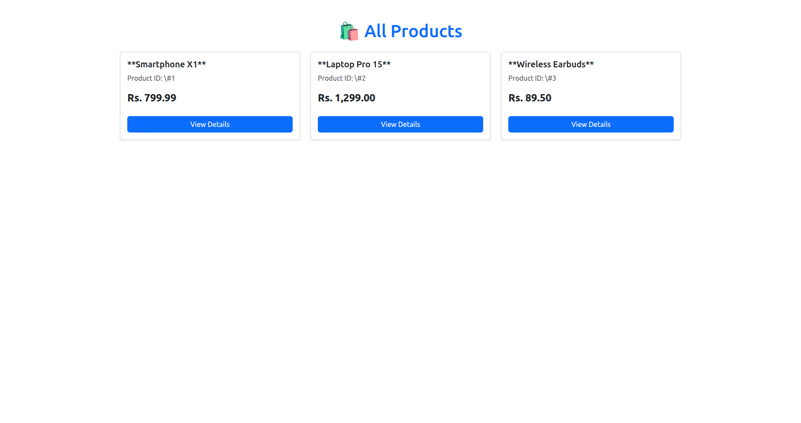
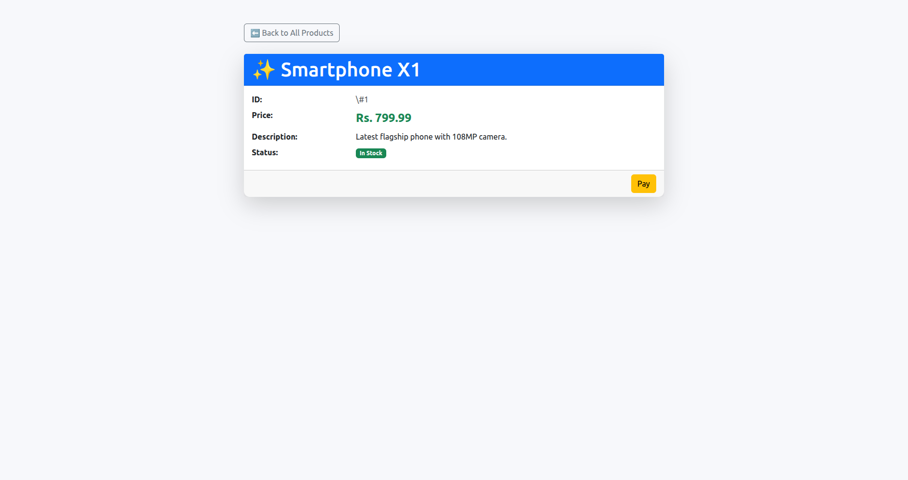
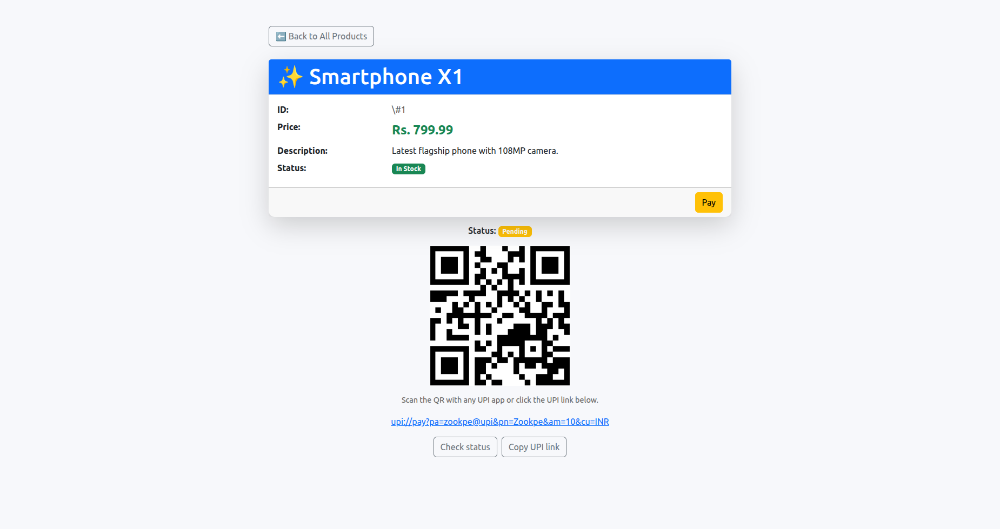

# Seamless Payment Integration — Laravel Demo

## Requirements
- PHP 8.4+
- Laravel 12.37.0 (tested)
- Internet access (required to call sandbox API)
- MySQL (for database setup)

---

## Install & Run

1. **Clone this repository**
   ```bash
   git clone https://github.com/DevSunilShaw/Seamless-Payment-App.git
   cd Seamless-Payment-App
   ```

The app will be available at **http://127.0.0.1:8000**

---

## Database Setup

### Option 1 — Run migrations (recommended)

1. Create a new MySQL database (e.g., `seamless_payment`).
2. Open the `.env` file in the project root and update your DB credentials:
   ```env
   DB_DATABASE=seamless_payment
   DB_USERNAME=root
   DB_PASSWORD=
   ```
3. Run the migration command:
   ```bash
   php artisan migrate
   php artisan serve
   ```
✅ If migrations run successfully, your app is ready.

---

### Option 2 — Import the test database (if migration fails)

If `php artisan migrate` fails for any reason:
1. Open phpMyAdmin or your MySQL client.
2. Import the provided **test.sql** file (available in the project root).
3. Ensure your `.env` file has the correct database credentials.
4. Restart the server if needed:
   ```bash
   php artisan serve
   ```

---

## Troubleshooting

If you face any dependency issues while running the app:
```bash
composer install
```
or
```bash
composer update
```
These will reinstall all necessary Laravel dependencies.

---

## Visit in Browser

Open your browser and go to: **http://127.0.0.1:8000**

### Step 1

You will see the Seamless Payment Interface with the "Pay" button.

### Step 2

Click “Pay” to create a test UPI transaction.
The UPI QR code and link will appear for scanning.
You can check transaction status using the “Check Status” button.

### Step 3

This section demonstrates:
- QR code (image or base64 render)
- A clickable UPI link (copyable)
- Payment amount and instructions

---

## What this implements

- **Create Transaction** → calls  
  `https://sandboxtest.space/en/purchase/create-transaction`
- **Get UPI Deposit Details** → calls  
  `https://sandboxtest.space/en/purchase/get-deposit-details`
- **Validate Transaction** → calls  
  `https://sandboxtest.space/api/v1/validate-transaction`
- **CSRF Protection** → included in Blade and JavaScript
- **Logging** → all API requests and responses are logged in  
  `storage/logs/laravel.log`

---

## Notes

- The sandbox sometimes returns an array-wrapped JSON, which the controller automatically normalizes.
- For local development, the controller uses `Http::withoutVerifying()` to avoid SSL verification issues.
- All newly created transactions return **Pending** status per assignment rules.
- The sandbox UPI ID (`zookpe@upi`) and merchant name (`ZookPe`) are part of the dummy sandbox environment.
- `.env` and `vendor/` directories are included intentionally for instant setup — no extra configuration needed.

---

## Author
**Name:** DevSunilShaw  
**Project:** Seamless Payment Integration (Laravel Demo)
